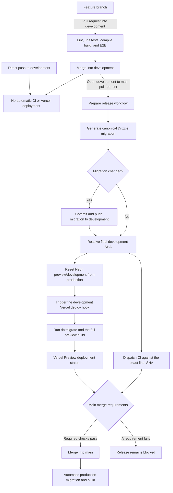

# Continuous Integration and Release Flow

Sharply separates feature validation, release preparation, preview deployment,
and production deployment. Feature work is validated before it reaches
`development`; a release pull request then validates and deploys the exact
commit proposed for `main`.

## System flow

## Feature validation

Pull requests targeting `development` automatically run four independent
GitHub Actions workflows:

- `lint.yml` runs ESLint.
- `unit-tests.yml` runs Vitest with coverage reporting.
- `build.yml` runs the compile-only Next.js build with placeholder configuration
  and no database-backed constant generation.
- `e2e-tests.yml` creates a hermetic PostgreSQL environment and runs Playwright.

These workflows do not receive production deployment credentials. Direct
pushes to `development` do not rerun them, because the feature pull request is
the validation boundary.

Vercel automatic deployments are disabled for all feature branches and for
`development`. Only `main` is allowed to deploy automatically. The fail-closed
rule uses the recursive `**` branch pattern so it also matches branch names that
contain `/`, such as `feature/search` or `chore/ci`.

## Release preparation and preview

Opening or updating the `development` to `main` pull request runs
`prepare-release.yml`. It is intentionally restricted to that exact head/base
combination because it can write migrations and access release credentials.

The workflow:

1. Checks out `development` and installs locked dependencies.
2. Runs `db:generate` to create the canonical Drizzle migration.
3. Commits and pushes changes under `drizzle/` when generation changed them.
4. Confirms the local commit is still the remote `development` head and records
   that exact SHA.
5. Dispatches lint, unit, compile-build, and E2E workflows with the SHA so the
   migration-bearing commit is validated.
6. Resets the persistent Neon `preview/development` branch from its production
   parent.
7. Calls the Vercel deploy hook configured for `development`.

The Vercel preview applies committed migrations with `npm run db:migrate` before
running the full application build. The preparation workflow only waits for the
Neon reset and deploy-hook request to start successfully; Vercel reports the
deployment result separately.

## Merge and production gates

The `main` ruleset requires:

- the `unit-tests` status for the final release commit; and
- a successful deployment to Vercel's `Preview` environment.

The other dispatched workflows remain visible release checks even when they are
not individually required by the ruleset. A failed required check or deployment
keeps the release pull request blocked.

After the release pull request merges, the push to `main` creates the automatic
production deployment. Its Vercel build command runs `npm run db:migrate` before
`npm run build`, applying only the migrations already committed and previewed.

## Configuration and credentials

The release workflow expects:

- `NEON_API_KEY` as a GitHub Actions secret;
- `NEON_PROJECT_ID` as a GitHub Actions repository variable; and
- `VERCEL_DEPLOY_HOOK_URL` as a GitHub Actions secret tied to `development`.

`neonctl` is pinned in `devDependencies` and invoked from the lockfile-installed
toolchain. Feature pull requests cannot access these release credentials.

For the E2E environment, fixtures, local reproduction, and failure debugging,
see [E2E testing](../e2e-testing.md).
